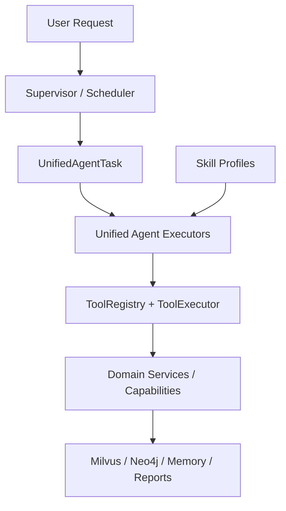

# Research-Copilot 统一 Agent / Runtime 迁移方案

这份文档对应仓库里的第一阶段统一骨架：

- [domain/schemas/unified_runtime.py](/home/myc/Research-Copilot/domain/schemas/unified_runtime.py)
- [services/research/unified_runtime.py](/home/myc/Research-Copilot/services/research/unified_runtime.py)

目标不是一次性推翻现有实现，而是先把“目标接口”固定下来，让后续重构变成渐进迁移。

## 1. 当前问题

当前仓库里有两套并行模式：

1. 底层 `RagRuntime`
   - 已经统一成 `SkillRegistry + ToolRegistry + ToolExecutor`
   - 更接近最终想要的标准模式

2. 高层 research runtime
   - `ResearchSupervisorGraphRuntime` 自带一套 `ResearchAgentTool`
   - specialist agent 里又混用了 YAML skill profile、Python skill class、service 直调

这会带来四个问题：

- “skill” 一词同时表示 profile 和 Python 类能力，概念混乱
- supervisor 同时负责调度、动作翻译、评估，职责过重
- 高层 action tool 没并入统一 `ToolRegistry`
- 部分 specialist 仍绕过 `ToolExecutor` 直接调 service

## 2. 目标统一架构



统一后的原则：

- `Skill` 只表示 profile：prompt、memory、retrieval、tool allowlist
- `Tool` 只表示统一 `ToolSpec`
- `Agent` 只表示会消费统一任务信封、并通过统一 runtime 上下文执行的角色
- `Service` 只表示纯业务实现，不再叫 skill

## 3. 对这个仓库的目标映射

### 保留不变

- `RagRuntime` 继续作为底层统一执行层
- `ToolRegistry` / `ToolExecutor` 继续作为唯一工具执行入口
- `SkillRegistry` 继续作为 profile 选择层

### 要收敛的部分

- `ResearchAgentTool` 全部逐步改造成标准 `ToolSpec`
- `ResearchSupervisorAgent` 退化成纯调度器
- `PaperReadingSkill / ReviewWritingSkill / ResearchEvaluationSkill` 这类 Python 类逐步改名为 `*Service` 或 `*Capability`
- specialist agent 统一实现同一个 executor 协议

## 4. 第一阶段已经落地的骨架

第一阶段不改行为，只新增统一抽象：

### 4.1 统一 schema

`domain/schemas/unified_runtime.py`

- `UnifiedAgentTask`
- `UnifiedAgentResult`
- `UnifiedSkillBinding`
- `UnifiedAgentDescriptor`
- `UnifiedRuntimeBlueprint`

作用：

- 先把未来统一模式里的任务信封、结果信封、agent 描述固定下来
- 为后续把 `AgentMessage` / `AgentResultMessage` 平滑迁移到统一格式做准备

当前补充说明：

- `UnifiedAgentResult` 现在已经把标准化动作结果提升为一等字段 `action_output`
- 兼容层仍会把同一份结构保留到 `metadata.unified_action_output`
- 旧的扁平 metadata 字段暂时还保留，用于避免调试面板和历史调用方一次性断裂

### 4.2 统一 registry / adapter

`services/research/unified_runtime.py`

- `UnifiedRuntimeContext`
- `UnifiedAgentExecutor`
- `UnifiedAgentRegistry`
- `PhaseOneUnifiedAgentAdapter`
- `build_phase1_unified_blueprint(...)`
- `build_phase1_unified_agent_registry(...)`

作用：

- 把当前 research agents 的目标形态先描述出来
- 保持旧执行路径不变
- 为阶段二把 supervisor action 并入 `ToolRegistry` 提前铺路

当前序列化约定：

- `unified_agent_results` 优先消费 `action_output`
- `unified_delegation_plan` 对已完成任务也会直接暴露 `action_output`
- 如果调用方仍读取 `metadata.unified_input_adapter`，当前阶段仍然兼容，但不建议继续依赖

## 5. 针对本仓库的迁移清单

### 阶段 1：统一抽象，不改行为

- [x] 新增统一 task/result envelope
- [x] 新增统一 agent descriptor
- [x] 新增统一 registry / phase1 adapter
- [x] 新增本仓库专用 blueprint builder
- [x] 补迁移文档和测试

### 阶段 2：把高层 action tool 收敛到 ToolRegistry

- [x] 在 Supervisor 内部为高层 action 建立标准 `ToolSpec/ToolExecutor` 包装层
- [x] `SearchLiteratureTool` — 已通过 `unified_action_adapters.py` 统一输入/输出
- [x] `WriteReviewTool` — 已通过 `unified_action_adapters.py` 统一输入/输出
- [x] `AnswerQuestionTool` — 已通过 `unified_action_adapters.py` 统一输入/输出
- [x] `AnalyzePapersTool` — 已通过 `unified_action_adapters.py` 统一输入/输出
- [x] `UnderstandDocumentTool` — 已通过 `unified_action_adapters.py` 统一输入/输出
- [x] `UnderstandChartTool` — 已通过 `unified_action_adapters.py` 统一输入/输出
- [x] `CompressContextTool` — 已通过 `unified_action_adapters.py` 统一输入/输出
- [x] `ImportPapersTool` / `SyncToZoteroTool` — 已通过 `unified_action_adapters.py` 统一输入/输出
- [x] `GeneralAnswerTool` / `RecommendFromPreferencesTool` / `AnalyzePaperFiguresTool` — 已实现

当前状态：

- 已完成 “**Supervisor 内部统一执行协议**” 和 “**统一动作适配器**”
- 尚未完成 “**把这些 action 发布为共享 runtime tool**”（当前仍为 Supervisor 私有 ToolRegistry）

也就是说，现在它们已经不再是纯私有直调，而是：

```text
Supervisor decision
-> local ToolRegistry
-> local ToolExecutor
-> legacy action delegate
```

这是保留纯 Supervisor 模式下最稳妥的中间态。

完成标准：

- supervisor 不再维护一套私有 `ResearchAgentTool` 字典
- 高层 action 的输入输出都有标准 schema
- 所有 action 都可以被 `ToolExecutor` 追踪

### 阶段 3：统一 specialist executor 协议

- [ ] `LiteratureScoutAgent` 实现统一 executor
- [ ] `ResearchKnowledgeAgent` 实现统一 executor
- [ ] `ResearchWriterAgent` 实现统一 executor
- [ ] `PaperAnalysisAgent` 实现统一 executor
- [ ] `ChartAnalysisAgent` 实现统一 executor
- [ ] `GeneralAnswerAgent` 实现统一 executor
- [ ] `PreferenceMemoryAgent` 实现统一 executor

完成标准：

- 每个 agent 都接收 `UnifiedAgentTask + UnifiedRuntimeContext`
- agent 内部不再直接依赖 supervisor 私有上下文对象

### 阶段 4：清理业务 skill 命名

- [ ] `PaperReadingSkill` -> `PaperReadingService`
- [ ] `ResearchEvaluationSkill` -> `ResearchEvaluationService`
- [ ] `ReviewWritingSkill` -> `ReviewWritingService`
- [ ] `WritingPolishSkill` -> `WritingPolishService`

完成标准：

- profile skill 与 Python 业务能力彻底分层
- “skill” 一词只剩一种含义

### 阶段 5：Supervisor 退化为纯调度器

- [ ] 把评估逻辑移到普通 tool 或 reviewer executor
- [ ] 把动作翻译移到标准 task planning 阶段
- [ ] 把恢复/重试/重排单独建 scheduler policy

完成标准：

- supervisor 只负责：
  - 生成任务
  - 分配 agent
  - 观察结果
  - 触发 replan / finalize

## 6. 推荐实施顺序

建议按下面顺序做，而不是一次性重写：

1. 先让 `ChartAnalysisAgent` 和 `ResearchKnowledgeAgent` 接统一 executor
2. 再把高层 `UnderstandChartTool` / `AnswerQuestionTool` 并入 `ToolRegistry`
3. 再迁移 `LiteratureScoutAgent`
4. 最后处理 `ResearchWriterAgent` 和 `PaperAnalysisAgent`
5. supervisor 最后瘦身

原因：

- `ChartAnalysisAgent` 和 `ResearchKnowledgeAgent` 已经最接近 tool-first 模式
- `ResearchWriterAgent` / `PaperAnalysisAgent` 混了较多 Python skill/service，后迁更稳

## 7. 第一阶段后的使用方式

如果你想在代码里查看这次骨架的“目标蓝图”，可以从：

```python
from services.research.unified_runtime import build_phase1_unified_blueprint

blueprint = build_phase1_unified_blueprint(
    graph_runtime=graph_runtime,
    research_service=research_service,
)
```

这会返回：

- 当前可见 skill profile
- 当前已注册 tool
- 目标 agent 描述
- 仍未统一的架构边界
- 推荐迁移阶段

## 8. 当前刻意没做的事

第一阶段没有做这些事：

- 没替换线上执行主路径
- 没把 `ResearchAgentTool` 直接删除
- 没改现有 API 返回格式
- 没强行改 Python business skill 的类名

这是刻意的，目的是把风险控制在“零行为回归”的范围里。
